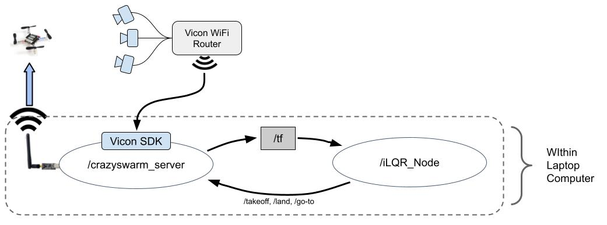

# crazyswarm-ilqr

The ROS workspace of the crazyswarm-ilqr project.

Project has been tested on the following environment:
- Core i7 Laptop
- Ubuntu 18.04
- ROS Melodic

This project relies heavily on the [crazyswarm](https://github.com/USC-ACTLab/crazyswarm) project as the underlying framework. Extensive documentation can be found on their Github repository and [here](https://crazyswarm.readthedocs.io/en/latest/index.html)

The paper on the framework is incredibly helpful in understanding how the system works and its limitations. The paper can be found [here](http://usc-actlab.github.io/publications/Preiss_ICRA2017.pdf) or in the crazyswarm documentation.


## Project Layout and Software Architecture

The software architecture laid out by the crazyswarm project works very well already. The only modifications made were to create a standalone ROS node to encapsulate the iLQR algorithm, and certain tweaks to CMake files to ensure dependencies are met.

The additional node that was created takes the pose of the crazyflies as input and produces waypoints for the aircraft to follow. The source code for this new node can be found in `src/iLQR/src/`. The node subscribes to the `/tf` topic for pose information and publishes commands to the `crazyswarm_server` node. The figure below illustrates a high-level overview of the software structure.



Although crazyswarm supports complex spline trajectories and other advanced functionality, only simple high-level commands like `go-to`, `takeoff`, and `land` were used for this project. These commands were found to sufficient for our objectives after tuning certain parameters.


## Code Break-down

This section will be taking apart the `iLQR_Node.cpp` file and providing functional description of the ROS interface. Code pertaining to the iLQR algorithm is not detailed as this is specific to the application and is most likely to change.

### Subscribing to /tf for pose information

The `/crazyswarm_server` node publishes pose information to the `/tf` topic for all the crazyflies that are being accounted for. The `iLQR_Node` subscribes to `/tf` with the following line:

```ros::Subscriber state_subscriber = n.subscribe("tf", 1000, poseCallback);```

The first argument `"tf"` specifices that topic that is being subscribed to. The second argument is a measure of the size of an input buffer. The default value of 1000 was found to work without problems. Most importantly, the final argument `poseCallback` is the name of a function defined in `iLQR_Node.cpp`. As the name suggests, this is a callback function which will be invoked everytime there is information published on the `/tf` topic.


```c++
void poseCallback(const tf2_msgs::TFMessage::ConstPtr& msg) {

    /* Collect pose and timestamp information */
    std::string cf_id = msg->transforms[0].child_frame_id;
    int secs = msg->transforms[0].header.stamp.sec;
    int nsecs = msg->transforms[0].header.stamp.nsec;
    float x = msg->transforms[0].transform.translation.x;
    float y = msg->transforms[0].transform.translation.y;
    float z = msg->transforms[0].transform.translation.z;
    float qx = msg->transforms[0].transform.rotation.x;
    float qy = msg->transforms[0].transform.rotation.y;
    float qz = msg->transforms[0].transform.rotation.z;
    float qw = msg->transforms[0].transform.rotation.w;
    tf2::Quaternion q(qx, qy, qz, qw);

    /* Quaternion to roll,pitch,yaw conversion */
    double roll, pitch, yaw;
    tf2::Matrix3x3 m(q);
    m.getRPY(roll, pitch, yaw);

    /* Calculate timestamp in nanoseconds*/
    unsigned long timeStamp = (secs * 1e9) + nsecs;
    double deltaT = 0.0;

    if (cf_id == "cf1") {
        CFState_cf1.x = x;
        CFState_cf1.y = y;
        CFState_cf1.z = z;
        CFState_cf1.roll = roll;
        CFState_cf1.pitch = pitch;
        CFState_cf1.yaw = yaw;
    } else if (cf_id == "cf2") {
        CFState_cf2.x = x;
        ...
        ..
        .
    }

    ...

}
```

## Usage Instructions

It is strongly suggested that you read the crazyswarm setup instructions first before returning here, as the setup process largely follows crazyswarm's instructions with the addition of a few tweaks to work in the IRL Flight Arena at the CSL Studio building.
