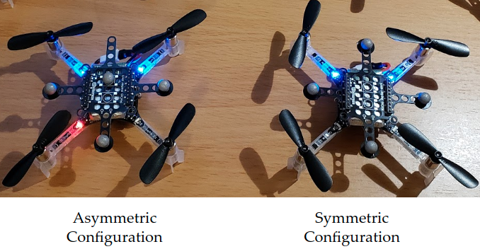
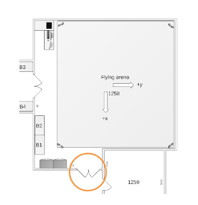

# crazyswarm-ilqr

The ROS workspace of the crazyswarm-ilqr project.

Project has been tested on the following environment:
- Core i7 Laptop
- Ubuntu 18.04
- ROS Melodic

This project relies heavily on the [crazyswarm](https://github.com/USC-ACTLab/crazyswarm) project as the underlying framework. Extensive documentation can be found on their Github repository and [here](https://crazyswarm.readthedocs.io/en/latest/index.html)

The paper on the framework is incredibly helpful in understanding how the system works and its limitations. The paper can be found [here](http://usc-actlab.github.io/publications/Preiss_ICRA2017.pdf) or in the crazyswarm documentation.


## Project Layout and Software Architecture

The software architecture laid out by the crazyswarm project works very well already. The only modifications made were to create a standalone ROS node to encapsulate the iLQR algorithm, and certain tweaks to CMake files to ensure dependencies are met.

The additional node that was created takes the pose of the crazyflies as input and produces waypoints for the aircraft to follow. The source code for this new node can be found in `src/iLQR/src/`. The node subscribes to the `/tf` topic for pose information and publishes commands to the `crazyswarm_server` node. The figure below illustrates a high-level overview of the software structure.


Although crazyswarm supports complex spline trajectories and other advanced functionality, only simple high-level commands like `go-to`, `takeoff`, and `land` were used for this project. These commands were found to sufficient for our objectives after tuning certain parameters.

## Code Break-down

This section will be taking apart the `iLQR_Node.cpp` file and providing functional description of the ROS interface. Code pertaining to the iLQR algorithm is not detailed as this is specific to the application and is most likely to change.

### Subscribing to /tf for pose information

The `/crazyswarm_server` node publishes pose information to the `/tf` topic for all the crazyflies that are being accounted for. The `iLQR_Node` subscribes to `/tf` with the following line:

```ros::Subscriber state_subscriber = n.subscribe("tf", 1000, poseCallback);```

The first argument `"tf"` specifices that topic that is being subscribed to. The second argument is a measure of the size of an input buffer. The default value of 1000 was found to work without problems. Most importantly, the final argument `poseCallback` is the name of a function defined in `iLQR_Node.cpp`. As the name suggests, this is a callback function which will be invoked every time there is information published on the `/tf` topic.

Shown below, the callback function is passed a single parameter of type `TFMessage::ConstPtr`. For our purposes, the callback was written to extract timestamp information, the global position, and an absolute orientation quaternion representing the pose of the crazyflies.

```c++
void poseCallback(const tf2_msgs::TFMessage::ConstPtr& msg) {

    /* Collect pose and timestamp information */
    std::string cf_id = msg->transforms[0].child_frame_id;
    int secs = msg->transforms[0].header.stamp.sec;
    int nsecs = msg->transforms[0].header.stamp.nsec;
    float x = msg->transforms[0].transform.translation.x;
    float y = msg->transforms[0].transform.translation.y;
    float z = msg->transforms[0].transform.translation.z;
    float qx = msg->transforms[0].transform.rotation.x;
    float qy = msg->transforms[0].transform.rotation.y;
    float qz = msg->transforms[0].transform.rotation.z;
    float qw = msg->transforms[0].transform.rotation.w;
    tf2::Quaternion q(qx, qy, qz, qw);

    /* Quaternion to roll,pitch,yaw conversion */
    double roll, pitch, yaw;
    tf2::Matrix3x3 m(q);
    m.getRPY(roll, pitch, yaw);

    /* Calculate timestamp in nanoseconds*/
    unsigned long timeStamp = (secs * 1e9) + nsecs;
    double deltaT = 0.0;

    if (cf_id == "cf1") {
        CFState_cf1.x = x;
        CFState_cf1.y = y;
        CFState_cf1.z = z;
        CFState_cf1.roll = roll;
        CFState_cf1.pitch = pitch;
        CFState_cf1.yaw = yaw;
    } else if (cf_id == "cf2") {
        CFState_cf2.x = x;
        ...
        ..
        .
    }

    ...

}
```

It is important to note that if multiple crazyflies are being used, the messages pertaining to each active crazyflie are interleaved and arrive in no guaranteed order. Hence the callback logic must decide which crazyflie the received message is associated with. In our implementation this is done through simple if/else statements. Using switch-case statements could be favorable for achieving lower latency for experiments with larger numbers of crazyflies.

### Sending commands through ROS services

The crazyswarm package provides multiple methods of sending commands of various complexity to the crazyflies. The method chosen for our experiments was to send high-level commands to ROS services. The high-level commands `/takeoff`, `/land`, and `/go_to` were sufficient to achieve our goals and proved to be very easy to get started with and adequately robust after some tuning.

In order to use these commands, `ros::ServiceClient` objects must be created with appropriate service names. The code snippet below shows the creation of these object instances. The constructors take as templated parameters in the <> brackets the type of service associated with the particular command.

```c++
ros::ServiceClient takeoffClient = n.serviceClient<crazyflie_driver::Takeoff>("/takeoff");
ros::ServiceClient landClient = n.serviceClient<crazyflie_driver::Land>("/land");
ros::ServiceClient GoToClient_cf1 = n.serviceClient<crazyflie_driver::GoTo>("/cf1/go_to");
ros::ServiceClient GoToClient_cf2 = n.serviceClient<crazyflie_driver::GoTo>("/cf2/go_to");
ros::ServiceClient GoToClient_cf3 = n.serviceClient<crazyflie_driver::GoTo>("/cf3/go_to");
ros::ServiceClient GoToClient_cf4 = n.serviceClient<crazyflie_driver::GoTo>("/cf4/go_to");
```

***NOTE:*** The `/takeoff` and `/land` command are sent to **all** crazyflies at the same time! Therefore, only one `ServiceClient` instance needs to be created for the two commands. The `/go_to` command, on the other hand, has a specific instance for each particular crazyflie. This requires separate `ServiceClient` instances pertaining to each crazyflie.

Since the GoTo command for each crazyflie are used repeatedly throughout the execution, `crazyflie_drive::GoTo` objects are created once at startup to be used later in the experiment loop.

Sending a Takeoff commands is done through the code snippet below. The first line creates an instance of a `crazyflie_driver::Takeoff` service object. The following three lines assign parameters associated with the Takeoff command. The `groupMask` field is set to `0` such that the command is issued to all active crazyflies. The `height` and `duration` parameters specify the height to which the crazyflie should ascend to and how long this maneuver should take. Once the service request is initialized and configured, the request is sent by invoking `takeoffClient.call(srvTakeoff);` . It is important to wait for the takeoff maneuver to complete before attempting to send other commands as this can cause erratic behavior. This accomplished simply by sleeping for the duration of the maneuver.

```c++
crazyflie_driver::Takeoff srvTakeoff;
srvTakeoff.request.groupMask = 0;
srvTakeoff.request.height = 1.0;
srvTakeoff.request.duration = ros::Duration(3.0);
takeoffClient.call(srvTakeoff);
ros::Duration(3.0).sleep();
```

Sending a GoTo command is done in a similar fashion as shown in the code snippet below. After issuing this command, the crazyflie will ***attempt*** to reach the goal position within the specified time duration. It is important that this duration parameter be kept large at first to avoid erratic behavior. The duration can then be tuned to lower values which will promote more aggressive maneuvering.

```c++
srvGoTo_cf1.request.goal.x = -0.2;
srvGoTo_cf1.request.goal.y = 1.1;
srvGoTo_cf1.request.goal.z = 1.5;
srvGoTo_cf1.request.yaw = 0.0;
srvGoTo_cf1.request.duration = ros::Duration(3.0);
GoToClient_cf1.call(srvGoTo_cf1);
```

The final Land command is very simple and follows the same premise as the Takeoff and GoTo commands.

```c++
crazyflie_driver::Land srvLand;
srvLand.request.duration = ros::Duration(3.0);
landClient.call(srvLand);
```

## Notes and Caveats

1. It was found that adopting an asymmetric marker pattern substantially improved the
   behavior of the pose tracking software integrated within the crazyflie package.
   
2. The reflections from glass door towards the South-West corner of the flight arena
   interferes with the Vicon motion capture system. The degradation in accuracy is
   noticeable was clearly observed by other researchers as there is a note on the
   door explaining the issue. The region should be avoided if possible.
   
